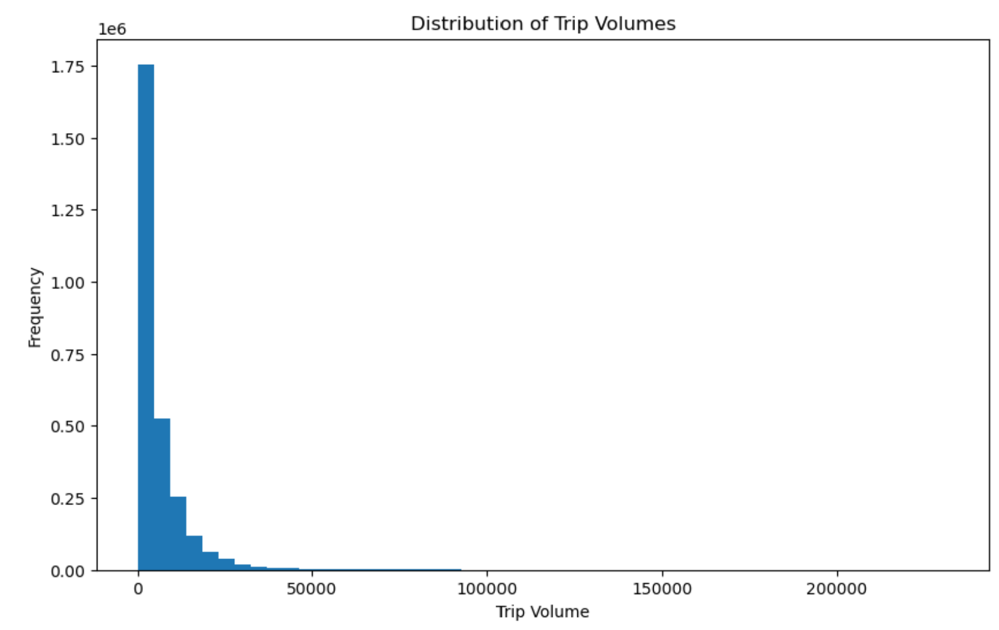
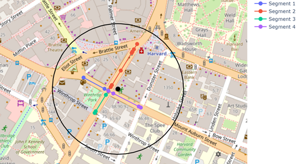

- [Final Idea: Geospatially-Motivated Functions and Visualization](#final-idea-geospatially-motivated-functions-and-visualization)
  - [Data Preprocessing and Ingestion](#data-preprocessing-and-ingestion)
  - [Initial EDA - Trip Volume Distribution](#initial-eda---trip-volume-distribution)
  - [Algorithm](#algorithm)
    - [Notes on match\_id](#notes-on-match_id)
    - [Note on identical rows except trip\_volume](#note-on-identical-rows-except-trip_volume)
    - [Zooming In on an Example:](#zooming-in-on-an-example)
    - [Point 1:](#point-1)
    - [Point 2:](#point-2)
- [Other Methods (Which Did Not Work)](#other-methods-which-did-not-work)
  - [Systematic Regression Analysis](#systematic-regression-analysis)
- [Future Directions and Ideas:](#future-directions-and-ideas)
- [Note on Final Product](#note-on-final-product)


# Final Idea: Geospatially-Motivated Functions and Visualization

## Data Preprocessing and Ingestion
- ingest.py function to ingest 
- our first speedup was reading geopandas file and paritioning it into each state and county to make the visualization easier to search for its respective 
- our next processing step was to remove PEDESTRIAN, cycle, and footwys from observations according to the HIGHWAY column, as they made up a non trivial amount of rows. This analysis was restricted to impressions from car observers and traffic only. 

## Initial EDA - Trip Volume Distribution

- in the initial EDA, we found that trip volumes, a component of the impressions target variable, are unevenly distributed, with a mean of  5,930, a standard deviation of  9,331, and a median of  3,012. The max value was  232,019. This is backed up intuitively by the visualization. 




## Algorithm

Our algorithm for determining impressions involves a kd-tree for range search. 
With a function, we specify all points within a certain radius of an inputted point. We feed county (for partitioning and performance reasons) and radius to our `get_neighbors` function, convert measures of distance to radians, and compute the number of points within the radius (in miles).

Running an example for Middleskex County in Massachussets (whoo!), we get 14 points in the dataset within a quarter mile distance from the center of Cambridge Massachussets (provided its latitude and longitude)

For example, our team's favorite cafe, Felipe's in Harvard Square, scored 6 points connecting to 3 different segments in a quarter mile radius. But we still need our score.  

### Notes on match_id

After checking a street we know well in Boston, we noticed that for a segment id, the one that has match_dir = 1 and the one with match_dir = 2 add up to the observation with match_dir = 3. 

So, when match_dir = 1, that `trips_volume` corresponds to the "correct"/"closest" side of the segment to the geometry. Thus, we have to consider `match_dir = 1` when computing impressions. This is a massively simplifying assumption as drivers can certainly look at other sides of the road while waiting at a red light, but are more likely to notice businesses on their side of the road. It will also be easier to pull into same road side businesses for most of the US, barring highways with no nearby exit to the adjacent side of the road. 

### Note on identical rows except trip_volume 

Since we noticed several instances where rows seemed identical minus the trip volume, which was interesting, we wanted to take those average of those volumes and combined them into one observation. 

After an unpacking of the geom data, we realized we could not dedupe as these were distinct geometries tied to distinct trip volumes. 

### Zooming In on an Example:



For example, when we zoom in on this provided store location (black dot) in Harvard Square, and filter for `match_id = 1`, we get segments that are on the correct side of the street to get impressions facing the storefront. In real life, those segments do have a direct line of sight to that store location. 

### Point 1: 

- convolution with **each** individual point

$$f(\vec{s}, \vec{d}) \in \mathbb{R}^1$$ 

### Point 2: 

# Other Methods (Which Did Not Work)
##  Systematic Regression Analysis

We originally brainstormed a variety of methods, attacking the **impressions** problem by getting intuition both through visual methods and through statistical methods. 

To start, we ran a systematic regression analysis, where the target was trip volumes. We tried Linear, LASSO, Ridge, ElasticNet, and even K Nearest Neighbors regression (this made sense as the data had a natural "radius" aspect to it). Also, all the data was scaled as it had massively different proportions. 

This required the encoding of categorical variables, taking the **center** of the geometries to make prediction easier, and dropping several variables:

```python
    excluded_cols = [target_variable, "id", "created_at", "updated_at", "geom", "day_type", 
                    "day_part", "segment_id", "trips_sample_count", "segment_name", "osm_id", 
                    "trips_sample_count_masked", "trips_volume_masked", "vmt"]
    feature_cols = [col for col in df.columns if col not in excluded_cols]
```

The code (found in systemic_testing.py) also systematically tried different subset of the set of features and recorded model performance on these ($R^2$, MSE, Feature Importance for random forest and decision tree methods). 

Unfortunately, these methods all yielded **terrible** $R^2$ scores, hovering as low as ~0.15 for ElasticNet and as high as 0.17 for Linear Regression. 

It was clear we had to discard this method and try a new one. 

<!-- this one is not perfect as the data is masked... 
removed a few confusing columns. 

also i unrolled the latitude and longitude and we just got the center of the data, since using the rolled up version as a feature would not work

for categorical variables we encoded them automatically 

and tried a variety of regression methods 

measure coefficients and feature importance 

simplifying assumption: take the center of latitude and longitude groups 

we systematically analyze any number and combination of features against the target, which is trips volunme 

these are the results:

* Performs systematic regression analysis on traffic data using multiple models (Linear, LASSO, Ridge, etc.)
  * Linear Regression - Basic linear model with no regularization
  * LASSO - L1 regularization, can eliminate features
  * Ridge - L2 regularization, shrinks feature coefficients
  * ElasticNet - Combines L1 and L2 regularization
  * HuberRegressor - Robust to outliers
  * KNN - Predicts based on nearest neighbors
  * DecisionTree - Tree-based predictions
  * RandomForest - Ensemble of trees
  * GradientBoosting - Sequential tree building
  * AdaBoost - Focuses on hard-to-predict cases
* Preprocesses data by encoding categorical variables and scaling numerical features
* Tests different combinations of features to find best predictors of trip volume
* Analyzes top performing models and their feature importance
* Creates detailed reports including model coefficients, R-squared scores, and MSE
* Saves model coefficients and analysis results to CSV files
* Uses various validation metrics to evaluate model performance
* Includes functions to print summaries of the analysis and encoding mappings
* Avoids certain columns (like IDs and timestamps) that aren't relevant for prediction
* Handles both categorical and numerical features appropriately for different model types -->


# Future Directions and Ideas:

Kernel Heat Map or Gaussian Blurring:
- We would like to experiment with Gaussian Blurring as the aggregator for trip volumes given a store location. 

# Note on Final Product

Please note that to arrive to our final product and algorithm, we had to throw out plenty of ideas and hundreds of lines of code. A systematic regression analysis that we tweaked to get some baseline activity proved that no simple combination of feature showed a truly promising $R^2$ on the impressions task. 

We settled on the visualization driven method. 


