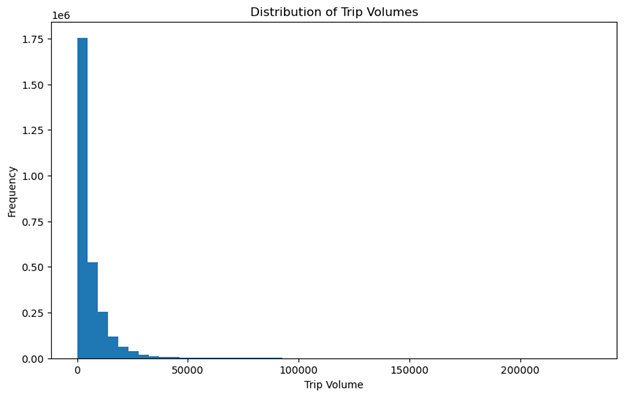
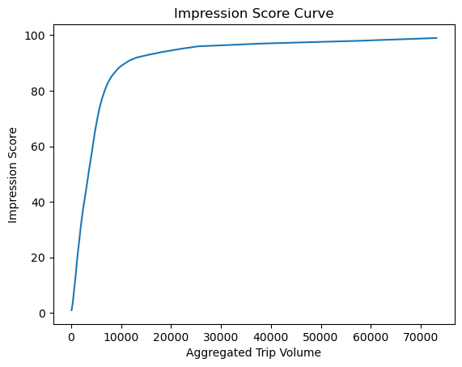
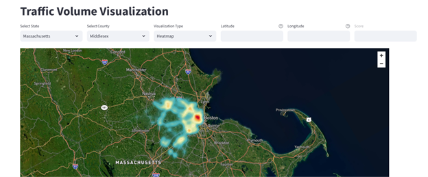
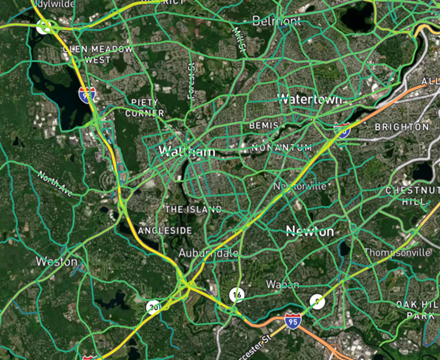

- [Final Idea: Geospatially-Motivated Scoring and Visualization](#final-idea-geospatially-motivated-scoring-and-visualization)
  - [Note on Final Product](#note-on-final-product)
  - [Data Preprocessing and Ingestion](#data-preprocessing-and-ingestion)
  - [Initial EDA - Trip Volume Distribution](#initial-eda---trip-volume-distribution)
  - [Algorithm](#algorithm)
    - [KD Tree for Range Search](#kd-tree-for-range-search)
    - [Notes on `match_id`](#notes-on-match_id)
    - [Note on identical rows except `trip_volume`](#note-on-identical-rows-except-trip_volume)
    - [Zooming In on an Example:](#zooming-in-on-an-example)
  - [The Impressions Calculation: Crux of the Algorithm](#the-impressions-calculation-crux-of-the-algorithm)
    - [The "County Percentile" Heuristic](#the-county-percentile-heuristic)
      - [Use the pre-made `county` Partitions!](#use-the-pre-made-county-partitions)
- [Application](#application)
- [Other Methods (Which Did Not Work)](#other-methods-which-did-not-work)
  - [Systematic Regression Analysis](#systematic-regression-analysis)
- [Future Directions and Ideas:](#future-directions-and-ideas)
- [Testing/Validation of our Approach](#testingvalidation-of-our-approach)

# Final Idea: Geospatially-Motivated Scoring and Visualization

## Note on Final Product

Please note that to arrive to our final product and algorithm, we had to throw out plenty of ideas and hundreds of lines of code. A systematic regression analysis that we tweaked to get some baseline activity proved that no simple combination of feature showed a truly promising $R^2$ on the impressions task. It also proved to be computationally intractable

We settled on the visualization driven method, which aligned closely with visual intuition. The full analysis details, examples, and observations leading to this method are well-documented on the Jupyter notebook. **Please refer to that notebook for more discussion.**

We also created a deployed Streamlit application to visualize the visibility and impressions, which takes in a pair of coordinates or geometries and returns both a score and a map of the location, neighboring points, and color-graded (by Kernel Density Estimation of nearby segments) intensities for usability/explorability. You can watch or experience the application demo and read more about it in our [application section](#application)

## Data Preprocessing and Ingestion

We first ingested the geopandas version of the data. Our first improvement on the existing data to improve performance was to partition the dataset into state and counties.

This partitioning proved to be crucial for the performance during data querying during exploration, data querying on the deployed Streamlit application, and the algorithm itself (which uses the county as the background for percentile scoring).

Our next processing step, after discussing some simplifying assumptions with Raj and Tanner, was to remove pedestrian, cycleways, and footpaths from the data. In the OSM HIGHWAY column, a non-trivial amount of rows were classified as these. This analysis was restricted to impressions from car observers and traffic only.

## Initial EDA - Trip Volume Distribution

In the initial EDA we found that trip volumes, a component of the impressions target variable, are unevenly distributed, with a mean of 5,930, a standard deviation of 9,331, and a median of 3,012. The max value was 232,019. This is backed up intuitively by this chart:

<!--  -->


## Algorithm

Our algorithm for determining impressions involves a kd-tree for range search, then scoring a location against percentile information of its county.

### KD Tree for Range Search

With a function, we return all points contained in the data within a certain radius of an input point (store). We feed the county of the point (for partitioning and performance reasons) and radius to our `get_neighbors` function, convert measures of distance to radians, and compute the number of points within the (fractional miles)radius.

Running an example for Middlesex County in Massachusetts, we get 14 points in the dataset within a quarter mile distance from the center of Cambridge Massachusetts (provided its latitude and longitude)

For example, our team's favorite cafe, Felipe's in Harvard Square, scored 6 points connecting to 3 different segments in a quarter mile radius. But we still need our impressions score!

### Notes on `match_id`

After checking a street we know well in Boston, we noticed that for a segment id, the one that has match_dir = 1 and the one with match_dir = 2 add up to the observation with match_dir = 3.

So, when match_dir = 1, that `trips_volume` corresponds to the "correct"/"closest" side of the segment to the geometry. Thus, we have to consider `match_dir = 1` when computing impressions. This is a massively simplifying assumption as drivers can certainly look at other sides of the road while waiting at a red light, but are more likely to notice businesses on their side of the road. It will also be easier to pull into same road side businesses for most of the US, barring highways with no nearby exit to the adjacent side of the road.

### Note on identical rows except `trip_volume`

Since we noticed several instances where rows seemed identical minus the trip volume, which was interesting, we wanted to take those average of those volumes and combined them into one observation.

After an unpacking of the geom data, we realized we could not dedupe as these were distinct geometries tied to distinct trip volumes.

### Zooming In on an Example:

For example, when we zoom in on this provided store location (black dot) in Harvard Square, and filter for `match_id = 1`, we get segments that are on the correct side of the street to get impressions facing the storefront. In real life, those segments do have a direct line of sight to that store location, verifying our visual intuition from the map visualization:

<!--  -->


## The Impressions Calculation: Crux of the Algorithm

We can answer the **impressions** question posed by the team by taking the mean of trip volumes for all nearest neighbors (computed by our KD Tree based function), for a provided pair of coordinates or geometries input, with some careful constraints. 

Note: When we aggregate the trip volumes for the segments in the given radius, we do a simple average, but this could be improved with a Parzen Window/density estimation.

```python
neighbors_df[neighbors_df['id'].isin(set(county_data_neighbors['id']))]['trips_volu'].mean()
```

Once we've aggregated the nearby trip volumes, we compute the impression score. 

We would like to normalize the impression score to be between 0 and 1. To perform the calibration of this score, we compute a set of `thresholds` based on the distribution of trip volumes in the county. The reason that this calibration is done at the county level is because it seems reasonable that a client may want to find a piece of property nearby at the local level, rather than a national search. See the below section for further discussion on this heuristic. The **$k$-th percentile** of trip volumes corresponds to the **$k$-th impression score**.



Note: There are other ways to calibrate the impression score. For example, instead of constraining the trip volumes, we could use the constraint than an **equal proportion of segments** have each impression score.  

### The "County Percentile" Heuristic

Counties are a natural demographic and political divisions, as well as useful data partitions for performance. If someone is looking for a future shop location, they will likely want to stay within a certain county.

Also, oftentimes, financial policies and business incentives set at the county level. For example, Cobb County has a small business incentive program, which will encourage clients to plan their store within its confines.

#### Use the pre-made `county` Partitions!

Since we had (in a sense) taken care of "wrong side of the road" impressions with `match_dir = 1`, and they are a useful heuristic as a "percentile background", we can also use the county partitions that already existed in our data. 


# Application

The application uses Kernel Density Estimation to assign colors to the areas depending on volume of points and segments nearby:





As you can see, the application returns a score for a set of latitudes and longitudes, and also provides an interactive visualization with satellite image overlays for clients.  

# Other Methods (Which Did Not Work)

## Systematic Regression Analysis

We originally brainstormed a variety of methods, attacking the **impressions** problem by getting intuition both through visual methods and through statistical methods.

To start, we ran a systematic regression analysis, where the target was trip volumes. We tried Linear, LASSO, Ridge, ElasticNet, and even K Nearest Neighbors regression (this made sense as the data had a natural "radius" aspect to it). Also, all the data was scaled as it had massively different proportions.

This required the encoding of categorical variables, taking the **center** of the geometries to make prediction easier, and dropping several variables:

```python
    excluded_cols = [target_variable, "id", "created_at", "updated_at", "geom", "day_type",
                    "day_part", "segment_id", "trips_sample_count", "segment_name", "osm_id",
                    "trips_sample_count_masked", "trips_volume_masked", "vmt"]
    feature_cols = [col for col in df.columns if col not in excluded_cols]
```

The code (found in systemic_testing.py) also systematically tried different subset of the set of features and recorded model performance on these ($R^2$, MSE, Feature Importance for random forest and decision tree methods). None of the subset of values trialed, even the ones that looked particularly promising, combined, yielded good results.

Unfortunately, these methods all yielded **terrible** $R^2$ scores, hovering as low as ~0.15 for ElasticNet and as high as 0.17 for Linear Regression.

It was clear we had to discard this method and try a new one.


# Future Directions and Ideas:

Parzen Window/density estimation
- We would like to refactor the aggregation of trip volumes under our given constraints to use Parzen Window/density estimation.

Kernel Heat Map or Gaussian Blurring:

- We would like to experiment with Gaussian Blurring as the aggregator for trip volumes given a store location.

Graphical Models and Graph Databases:

- Given more time, we would have liked to explore segment connections and relationships with graph relationships. There is an argument to be made that

# Testing/Validation of our Approach

We tested a few local (to us) locations in Boston with extremely high traffic and impressions, and our algorithm and application yielded a high score for all of these. 

We also noticed that our method picked up on **subtle traffic patterns and brought those into our impressions score**. A location in an area that had a high potential impressions score scored lower than an adjacent storefront which was on an intersection with two streets facing it, which allowed for more eyes on the store location from car traffic. 


